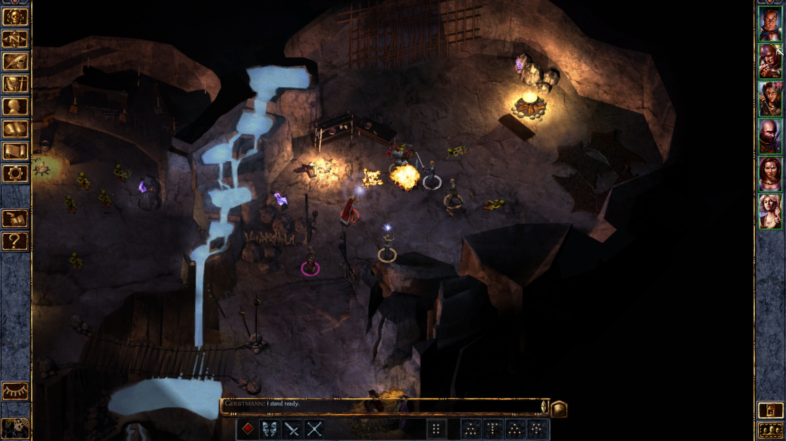

## 
D&D jako takové je pro většinu lidí známé jako sada pravidel pro stolní hry na hrdiny s perem a papírem. Ale od zhruba konce let devadesátých, se pojem D&D začal objevovat i ve světě her počítačových. 

Společnost Wizzard of the Coast, vydavatel D&D, se spolčil s vydavatelstvím počítačových her Interplay Entertainment a vývojářským studiem BioWare. A dali tím vzniknout hernímu enginu Infinity, který adaptoval tahový, herní systém D&D, v druhé a později i třetí edici pravidel, do virtuálního prostoru s izometrickým zobrazením a reálným časem.

Na tradici původních her z konce devadesátých let v současnosti navazují další obdobné projekty, které ale často z licenčních důvodů pracují s alternativními P&P herními systémy.
